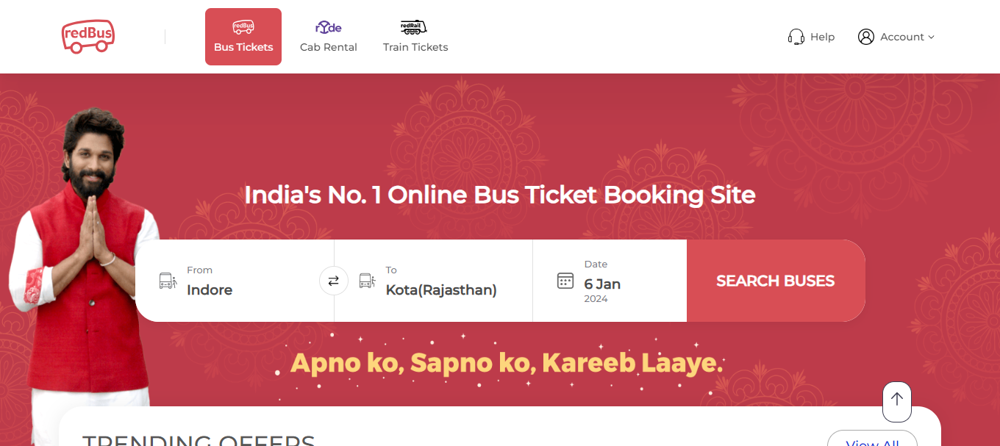

## Redbus homepage UI clone Project

Hello there! I created Redbus homepage Clone project, this was crafted using HTML and CSS, two backbone technologies in web development. My primary goal in building Redbus homepage clone project was to brush up on my skills and gain a deeper understanding of this technology.

## Tech Used

- HTML
- CSS

## Website Link

[Redbus Clone Website](https://himanshu-paliwal-277.github.io/Project-3-Redbus-clone/)

## Project Screenshot

